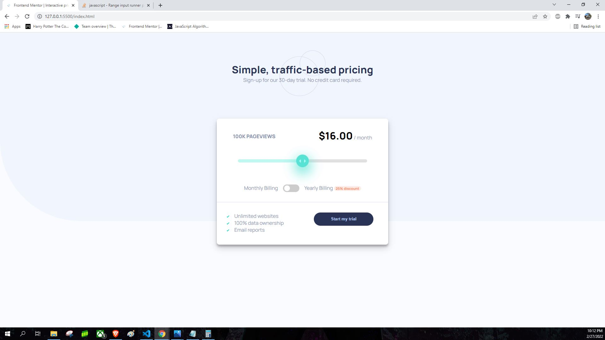
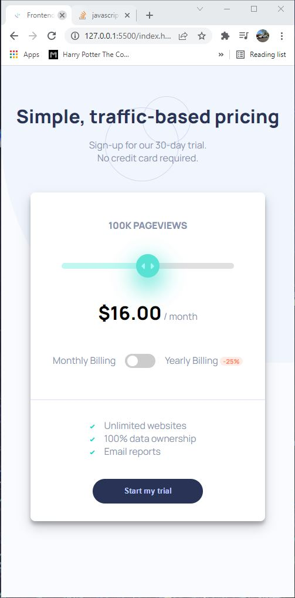

# Frontend Mentor - Interactive pricing component solution

This is a solution to the [Interactive pricing component challenge on Frontend Mentor](https://www.frontendmentor.io/challenges/interactive-pricing-component-t0m8PIyY8). Frontend Mentor challenges help you improve your coding skills by building realistic projects.

## Table of contents

- [Overview](#overview)
  - [The challenge](#the-challenge)
  - [Screenshot](#screenshot)
  - [Links](#links)
- [My process](#my-process)
  - [Built with](#built-with)
  - [What I learned](#what-i-learned)
  - [Continued development](#continued-development)
  - [Useful resources](#useful-resources)
- [Author](#author)
- [Acknowledgments](#acknowledgments)

## Overview

### The challenge

Users should be able to:

- View the optimal layout for the app depending on their device's screen size
- See hover states for all interactive elements on the page
- Use the slider and toggle to see prices for different page view numbers

### Screenshot




### Links

- Solution URL: [https://github.com/TheLegend760/Interactive-Pricing]
- Live Site URL: [https://kev-interactive-pricing.netlify.app/]

## My process

### Built with

- Semantic HTML5 markup
- CSS custom properties
- Flexbox
- Vanilla JS

### What I learned

-Switch statements can be used instead of if statements on javascript.
-Input range slider style can be changed with css.
-How checkbox functions work when being checked and how you can add functions on javascript if itss checked or not.
-You can give range slider min, max, and value on html.

```html
<input
  type="range"
  class="range-slider"
  id="myRange"
  min="1"
  max="5"
  value="3"
/>
```

```css
.range-slider::-webkit-slider-thumb {
  -webkit-appearance: none;
  appearance: none;
  width: 25px;
  height: 14px;
  border: 0;
  background-image: url("./images/icon-slider.svg");
  background-position: center;
  background-repeat: no-repeat;
  background-color: hsl(174, 86%, 45%);
  cursor: pointer;
  border-radius: 50%;
  padding: 1.5em;
  box-shadow: 1px 15px 40px 5px hsl(174, 86%, 45%);
}
```

```js
function sliderfunc() {
    slider.oninput = function() {
        switch (parseInt(this.value)) {
            case 1:
                pageviewText.innerHTML = '10K PAGEVIEWS';
                priceText.innerHTML = '8';
                break;
            case 2:
                pageviewText.innerHTML = '50K PAGEVIEWS';
                priceText.innerHTML = '12';
                break;
            case 3:
                pageviewText.innerHTML = '100K PAGEVIEWS';
                priceText.innerHTML = '16';
                break;
            case 4:
                pageviewText.innerHTML = '500K PAGEVIEWS';
                priceText.innerHTML = '24';
                break;
            case 5:
                pageviewText.innerHTML = '1M PAGEVIEWS';
                priceText.innerHTML = '36';
                break;

                default:
                    pageviewText.innerHTML = '100K PAGEVIEWS';
                    priceText.innerHTML = '16';

        }
        };

};

}
```

### Continued development

I am still not comfortable with switch statements and will continue to do projects or look on articles on how to master it. I also want to master more on vanilla javascript and see If I can write cleaner functions. I want to learn on APIs and
a framework in the future so I can use peoples to code, once I get to know more vanilla javascript.

### Useful resources

- [https://stackoverflow.com/questions/60428639/range-input-runner-progress-fill-color] - This helped me figure out how to change the slider background when it is being triggered. I used the code provided.

- [https://www.w3schools.com/css/css3_flexbox_items.asp] - This article helped me
  with being able to switch flex box divs on different places.

## Author

- Frontend Mentor - [@TheLegend760](https://www.frontendmentor.io/profile/TheLegend760)
- Twitter - [@CoderKevo](https://www.twitter.com/CoderKevo)

## Acknowledgments

I wanted to thank the people on stackoverflow.com and w3school.com, those the the websites I constantly use to find solutions to questions I need or am stuck on. Flexbox helped me be able to switch the divs when the design is switched to mobile. With the help of switch statements, I was able to change the monthly cost text, but I do feel like it can be better written. As I progress, I want to look back on my code I created and make it look more cleaner. Thank you Frontend.io for providing the projects to help us aspiring coders out.
